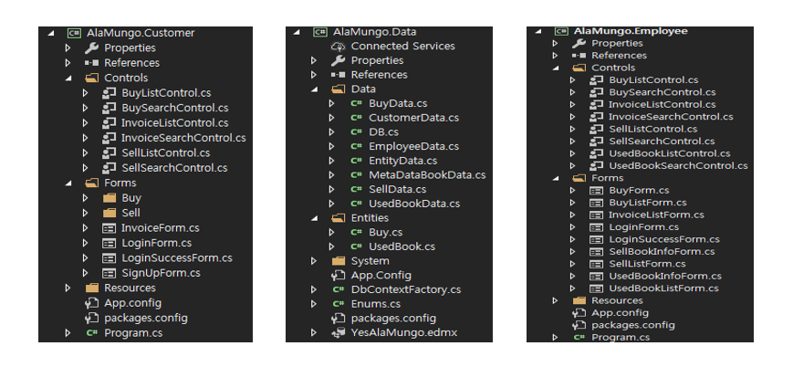

# **YesAlaMungo**  

### **C# Team Project**  
팀원 : 권세연, 김유민, 박동일, 박형준, 최해송  
나의 역할 : 주제 선정 및 데이터베이스 테이블 설계(공통), 직원용 시스템-고객 구매관리 부분 구현  

# **YesAlaMungo 프로그램이란?**  
  
  
# **클래스다이어그램**  
 
# **프로젝트 구성도**  

 
# **장점**  
-직원이 전체적인 데이터를 관리하고 처리하기 쉽다.  
-중고책 구매자가 프로그램을 이용해서 온라인으로 쉽게 책을 구매 할 수 있다.  
# **단점**  
-중고책 판매자가 중고책을 팔기 위해서 프로그램에 등록은 할 수 있지만 책을 들고 매장에 직접 방문 해야 한다는 번거로움이 있다.  
-판매 등록시 MetaDataBook에 의존한다.  
-구매, 판매, 등록 을 여러 개가 아니라 한 개 씩 등록 할 수 있다.  
# **개발환경**    
OS :　windows 7 Professional K  
CPU : intel(R) Core™ i7-5790 CPU @ 3.60GHz   
Memory : 8G   
IDE : Microsoft Visual studio 2019 Version 16.0.3  
Compiler Ver : Roslyn 3.1.1  
Microsoft .NET Framework : 4.6  
Entity Framework   
언어 : C#  
# **구동 영상 URL**  
https://youtu.be/HAyRiW_ollA  
# **기대 효과**    
본 프로그램을 통하여 중고서적 정보의 CRUD를 보다 쉽게 관리할 수 있다.  
책의 행 정보를 더블 클릭하여 가격 및 등급, 상태 등 여러 정보를 띄어주어 편리한 검색이 가능하다.  
